# Population Health Analytics: HEDIS SPD Care Gap Analysis

   

## 📑 Table of Contents
📌 [**Overview**](#-project-overview)
🛠 [**Tech Stack & Skills**](#-tech-stack--skills)
🧠 [**Clinical Logic**](#-clinical-logic--safety-workflow)
💻 [**SQL Logic**](#-sql-logic)
📊 [**Dashboard & Visualization (Power BI)**](#-dashboard--visualization)
⚠️ [**Limitations**](#limitations)

---

## 📌 Project Overview
**Objective:** To automate the identification of care gaps for **Statin Therapy for Patients with Diabetes (SPD)**, a key HEDIS quality measure, while incorporating a robust **Clinical Safety Layer** to prevent medical errors and provider alert fatigue.

**Business Problem:**
Health systems must identify diabetic patients (Age 40-75) not on statin therapy to meet quality metrics. However, standard queries often generate **false positives** by flagging patients who have legitimate clinical contraindications (e.g., Pregnancy, Liver Disease) or documented intolerance, leading to provider alert fatigue.

**My Solution (PharmD & Data Analyst Approach):**
I developed a SQL algorithm that goes beyond simple gap analysis by integrating **Safety & Contraindication Logic**:
1.  **Guideline Adherence:** Classifies Statin Intensity (High vs. Moderate) based on ACC/AHA guidelines.
2.  **Safety Guardrails (Contraindication Check):** Automatically excludes patients with **Pregnancy** (Teratogenic risk) or **Active Liver Disease**.
3.  **Intolerance Filtering:** Filters out patients with history of Myalgia or Rhabdomyolysis.

---

## 🛠 Tech Stack & Skills
This project demonstrates the intersection of **Clinical Knowledge** and **Technical Implementation**.

* **Languages:** SQL (MySQL/PostgreSQL Syntax)
* **Domain Knowledge:** Population Health Management, HEDIS Measures, Patient Safety
* **Standards:** ICD-10, ACC/AHA Guidelines, RxNorm
* **Key Techniques:**
    * **Cohort Selection:** Filtering by Age, Diagnosis, and Medication status.
    * **Clinical Logic Mapping:** Translating medical guidelines into `CASE WHEN` logic.
    * **Data Cleaning:** Handling NULLs and unstructured exclusions.

---

## 🧠 Clinical Logic & Safety Workflow
This project utilizes my **Pharm.D. background** to filter data based on clinical safety profiles.

```mermaid
graph TD
    A[T2DM Patient Age 40-75] --> B{Active Statin?}
    B -- No --> C{Check Safety / Contraindications}
    C -- Pregnancy/Liver Disease --> D[Excluded: Safety Risk 🛑]
    C -- Intolerance History --> E[Excluded: Intolerance]
    C -- None --> F[GAP DETECTED: Initiate Therapy 🚨]
    B -- Yes --> G{Intensity Check}
    G -- High --> H[Compliant ✅]
    G -- Mod/Low --> I[Optimization Opportunity ⚠️]
```



* **Inclusion Criteria (The Denominator):**
    * Age: 40 - 75 years
    * Diagnosis: Type 2 Diabetes (ICD-10 `E11.%`)
* **Safety & Exclusion Criteria (The "Do No Harm" Layer):**
    * **Pregnancy (Category X):** Excludes ICD-10 `O00-O9A` (Pregnancy) and `Z33.1`. Statins are contraindicated due to teratogenic risks.
    * **Liver Disease:** Excludes `K70-K77` (e.g., Cirrhosis, Hepatitis). Statins undergo hepatic metabolism and can worsen liver injury.
    * **Intolerance:** Excludes `M79.1` (Myalgia), `M62.82` (Rhabdomyolysis).

---

## 💻 SQL Logic
*Note: This query simulates a production environment analysis using standard SQL syntax.*

```sql
/*
Project: HEDIS SPD Gap Analysis with Safety Logic
Author: Jin-Young An, PharmD
Logic: Identify diabetic patients needing statin therapy while excluding unsafe candidates (Pregnancy, Liver Disease, Intolerance).
*/

WITH Target_Population AS (
    -- 1. Identify Denominator: Patients 40-75 with T2DM
    SELECT
        p.patient_id,
        TIMESTAMPDIFF(YEAR, p.birth_date, CURRENT_DATE) AS age,
        p.gender
    FROM patients p
    JOIN diagnoses d ON p.patient_id = d.patient_id
    WHERE d.icd_code LIKE 'E11%' -- ICD-10 Family for Type 2 Diabetes
      AND TIMESTAMPDIFF(YEAR, p.birth_date, CURRENT_DATE) BETWEEN 40 AND 75
),

Clinical_Exclusions AS (
    -- 2. Safety & Contraindication Check (PharmD Logic)
    
    -- A. Intolerance (Muscle Pain, Rhabdomyolysis)
    SELECT DISTINCT patient_id, 'History of Intolerance' AS reason
    FROM diagnoses
    WHERE icd_code IN ('M79.1', 'M62.82', 'G72.0')
    
    UNION
    
    -- B. Pregnancy / Breastfeeding (Safety Exclusion)
    -- Statins are contraindicated in pregnancy (Formerly Category X)
    SELECT DISTINCT patient_id, 'Contraindication: Pregnancy' AS reason
    FROM diagnoses
    WHERE icd_code LIKE 'O%'       -- Obstetric codes
       OR icd_code IN ('Z33.1', 'Z32.01') -- Pregnant state
    
    UNION

    -- C. Active Liver Disease
    -- Contraindicated in active liver disease or unexplained transaminase elevations
    SELECT DISTINCT patient_id, 'Contraindication: Liver Disease' AS reason
    FROM diagnoses
    WHERE icd_code LIKE 'K70%'     -- Alcoholic liver disease
       OR icd_code LIKE 'K74%'     -- Cirrhosis
       OR icd_code = 'B18.2'       -- Chronic Hepatitis C
),

Medication_Check AS (
    -- 3. Check Pharmacy Claims & Determine Intensity
    SELECT
        tp.patient_id,
        m.med_name,
        m.dosage_mg,
        CASE
            WHEN m.med_name IN ('Atorvastatin', 'Rosuvastatin') AND m.dosage_mg >= 40 THEN 'High'
            WHEN m.med_name IS NOT NULL THEN 'Moderate/Low'
            ELSE 'None'
        END AS intensity
    FROM Target_Population tp
    LEFT JOIN medications m
        ON tp.patient_id = m.patient_id
        AND m.med_category = 'Statin'
        AND m.status = 'Active'
)

-- 4. Final Actionable Report
SELECT 
    mc.patient_id,
    tp.age,
    tp.gender,
    COALESCE(mc.med_name, 'None') AS current_med,
    CASE 
        WHEN ex.patient_id IS NOT NULL THEN 'Excluded (Safety/Intolerance)'
        WHEN mc.intensity = 'None' THEN 'GAP: Needs Therapy'
        WHEN mc.intensity = 'Moderate/Low' THEN 'Review: Optimization Oppty'
        ELSE 'Compliant'
    END AS clinical_status,
    ex.reason AS exclusion_details
FROM Medication_Check mc
LEFT JOIN Clinical_Exclusions ex ON mc.patient_id = ex.patient_id
JOIN Target_Population tp ON mc.patient_id = tp.patient_id
ORDER BY clinical_status;
```

---

## 📊 Dashboard & Visualization (Power BI)
I developed an interactive **Power BI Dashboard** to translate the raw SQL output into actionable insights for different stakeholders.

### 1. Executive Summary (Leadership View)
**Target Audience:** Medical Directors, Quality Managers
* **Key Insight:** The current Statin Adherence Rate is **46.77%**, significantly below the CMS Star Rating target of **80%**.
* **Analysis:** The visualization highlights that the **40-50 age group** has the highest gap rate, suggesting a need for targeted patient education in younger demographics.


*(Note: Visuals are based on mock data. Red indicates non-compliance/gaps, Green indicates compliance.)*

### 2. Pharmacist Action List (Operational View)
**Target Audience:** Clinical Pharmacists, Care Gap Coordinators
* **Workflow:** This page filters the data to show only **142 actionable patients** (excluding those with safety contraindications).
* **Efficiency:** Eliminates manual chart review by prioritizing patients with "GAP: Needs Therapy" status.


### 🛠️ Technical Implementation (DAX)
To ensure dynamic reporting, I utilized **DAX (Data Analysis Expressions)** for key performance indicators:

* **Statin Adherence Rate:** Calculated using the PDC (Proportion of Days Covered) logic concept.
    ```dax
    Statin Adherence Rate = 
    VAR Denominator = [Total Patients] - [Excluded Count]
    RETURN DIVIDE([Compliant Count], Denominator, 0)
    ```
* **Dynamic Filtering:** Implemented page-level filters to segregate 'Safety Exclusions' (Pregnancy/Liver Disease) from 'Actionable Gaps'.

> **📂 File Note:** The full Power BI project file (`.pbix`) is available in this repository for review.


---
<a id="limitations"></a>
## ⚠️ Real World Limitations
Through my experience as a **Medical Assistant**, I observed that data in the EHR does not always reflect the patient's true clinical status.

1.  **Unstructured Documentation:**
    * Providers often document reasons for discontinuation in **free-text notes** (e.g., *"Patient stopped meds due to leg cramps"*) rather than using structured diagnosis codes.
    * **Implication:** A SQL query relying only on ICD-10 codes may miss these details, leading to false positives.
    * **Solution:** Future iterations should incorporate **NLP (Natural Language Processing)** or SQL text-mining (`LIKE '%cramps%'`) on clinical notes.

2.  **Discontinued Medications:**
    * Medications often appear 'Active' in the EHR even if the patient stopped taking them months ago.
    * **Solution:** Incorporate `Last_Fill_Date` logic to flag medications with no refills in >6 months for **Medication Reconciliation**.
