# Population Health Analytics: HEDIS SPD Care Gap Analysis

    

## 📑 Table of Contents
📌 [**Overview**](#-project-overview)
🛠 [**Tech Stack & Skills**](#-tech-stack--skills)
🧠 [**Clinical Logic**](#-clinical-logic--safety-workflow)
💻 [**SQL Logic**](#-sql-logic)
📊 [**Sample Output**](#-sample-output)
📈 [**Dashboard & Visualization**](#-dashboard--visualization-power-bi)
⚠️ [**Limitations**](#limitations)

---

## 📌 Project Overview
**Objective:** To automate the identification of care gaps for **Statin Therapy for Patients with Diabetes (SPD)**, a key HEDIS quality measure, while incorporating a robust **Clinical Safety Layer** to prevent medical errors.

**Business Problem:**
Health systems must identify diabetic patients (Age 40-75) not on statin therapy to meet quality metrics. However, standard queries often generate **false positives** by flagging patients who have legitimate clinical contraindications (e.g., Pregnancy, Liver Disease), leading to provider alert fatigue.

**My Solution (PharmD & Data Analyst Approach):**
I developed a SQL algorithm that goes beyond simple gap analysis by integrating **Safety & Contraindication Logic**:
1.  **Guideline Adherence:** Classifies Statin Intensity (High vs. Moderate) based on ACC/AHA guidelines.
2.  **Safety Guardrails:** Automatically excludes patients with **Pregnancy** (Teratogenic risk) or **Active Liver Disease**.
3.  **Intolerance Filtering:** Filters out patients with history of Myalgia or Rhabdomyolysis.

---

## 🛠 Tech Stack & Skills
This project demonstrates the intersection of **Clinical Knowledge** and **Technical Implementation**.

* **Languages:** SQL (MySQL/PostgreSQL Syntax)
* **Visualization:** Power BI (Data Modeling, DAX)
* **Domain Knowledge:** Population Health Management, HEDIS Measures, Patient Safety
* **Standards:** ICD-10, ACC/AHA Guidelines, RxNorm
* **Key Techniques:**
    * **Cohort Selection:** Filtering by Age, Diagnosis, and Medication status.
    * **Clinical Logic Mapping:** Translating medical guidelines into `CASE WHEN` logic.

---

## 🧠 Clinical Logic & Safety Workflow
This project utilizes my **Pharm.D. background** to filter data based on clinical safety profiles.

```mermaid
graph TD
    A[T2DM Patient Age 40-75] --> B{Active Statin?}
    B -- No --> C{Check Safety / Contraindications}
    C -- Pregnancy/Liver Disease --> D[Excluded: Safety Risk 🛑]
    C -- Intolerance History --> E[Excluded: Intolerance]
    C -- None --> F[GAP DETECTED: Initiate Therapy 🚨]
    B -- Yes --> G{Intensity Check}
    G -- High --> H[Compliant ✅]
    G -- Mod/Low --> I[Optimization Opportunity ⚠️]
```



* **Inclusion Criteria (The Denominator):**
    * Age: 40 - 75 years
    * Diagnosis: Type 2 Diabetes (ICD-10 `E11.%`)
* **Safety & Exclusion Criteria (The "Do No Harm" Layer):**
    * **Pregnancy (Category X):** Excludes ICD-10 `O00-O9A` (Pregnancy) and `Z33.1`. Statins are contraindicated due to teratogenic risks.
    * **Liver Disease:** Excludes `K70-K77` (e.g., Cirrhosis, Hepatitis).
    * **Intolerance:** Excludes `M79.1` (Myalgia), `M62.82` (Rhabdomyolysis).

---

## 💻 SQL Logic
*Note: This query simulates a production environment analysis using standard SQL syntax.*

```sql
/*
Project: HEDIS SPD Gap Analysis with Safety Logic
Author: Jin-Young An, PharmD
Logic: Identify diabetic patients needing statin therapy while excluding unsafe candidates.
*/

WITH Target_Population AS (
    -- 1. Identify Denominator: Patients 40-75 with T2DM
    SELECT
        p.patient_id,
        TIMESTAMPDIFF(YEAR, p.birth_date, CURRENT_DATE) AS age,
        p.gender
    FROM patients p
    JOIN diagnoses d ON p.patient_id = d.patient_id
    WHERE d.icd_code LIKE 'E11%' -- ICD-10 Family for Type 2 Diabetes
      AND TIMESTAMPDIFF(YEAR, p.birth_date, CURRENT_DATE) BETWEEN 40 AND 75
),

Clinical_Exclusions AS (
    -- 2. Safety & Contraindication Check (PharmD Logic)
    
    -- A. Intolerance (Muscle Pain, Rhabdomyolysis)
    SELECT DISTINCT patient_id, 'History of Intolerance' AS reason
    FROM diagnoses
    WHERE icd_code IN ('M79.1', 'M62.82', 'G72.0')
    
    UNION
    
    -- B. Pregnancy / Breastfeeding (Safety Exclusion)
    SELECT DISTINCT patient_id, 'Contraindication: Pregnancy' AS reason
    FROM diagnoses
    WHERE icd_code LIKE 'O%'        -- Obstetric codes
       OR icd_code IN ('Z33.1', 'Z32.01') -- Pregnant state
    
    UNION

    -- C. Active Liver Disease
    SELECT DISTINCT patient_id, 'Contraindication: Liver Disease' AS reason
    FROM diagnoses
    WHERE icd_code LIKE 'K70%'      -- Alcoholic liver disease
       OR icd_code LIKE 'K74%'      -- Cirrhosis
       OR icd_code = 'B18.2'        -- Chronic Hepatitis C
),

Medication_Check AS (
    -- 3. Check Pharmacy Claims & Determine Intensity
    SELECT
        tp.patient_id,
        m.med_name,
        m.dosage_mg,
        CASE
            WHEN m.med_name IN ('Atorvastatin', 'Rosuvastatin') AND m.dosage_mg >= 40 THEN 'High'
            WHEN m.med_name IS NOT NULL THEN 'Moderate/Low'
            ELSE 'None'
        END AS intensity
    FROM Target_Population tp
    LEFT JOIN medications m
        ON tp.patient_id = m.patient_id
        AND m.med_category = 'Statin'
        AND m.status = 'Active'
)

-- 4. Final Actionable Report
SELECT 
    mc.patient_id,
    tp.age,
    tp.gender,
    COALESCE(mc.med_name, 'None') AS current_med,
    CASE 
        WHEN ex.patient_id IS NOT NULL THEN 'Excluded (Safety/Intolerance)'
        WHEN mc.intensity = 'None' THEN 'GAP: Needs Therapy'
        WHEN mc.intensity = 'Moderate/Low' THEN 'Review: Optimization Oppty'
        ELSE 'Compliant'
    END AS clinical_status,
    ex.reason AS exclusion_details
FROM Medication_Check mc
LEFT JOIN Clinical_Exclusions ex ON mc.patient_id = ex.patient_id
JOIN Target_Population tp ON mc.patient_id = tp.patient_id
ORDER BY clinical_status;
```

---

## 📊 Sample Output
The SQL query generates a clean dataset identifying care gaps while explicitly flagging safety exclusions.

| patient_id | age | gender | current_med | clinical_status | exclusion_details |
| :--- | :--- | :--- | :--- | :--- | :--- |
| **P1001** | 56 | Male | None | **Excluded (Safety/Intolerance)** | History of Intolerance |
| **P1002** | 48 | Female | None | **GAP: Needs Therapy** | NULL |
| **P1003** | 72 | Female | Rosuvastatin 40mg | **Compliant** | NULL |
| **P1006** | 67 | Male | Atorvastatin 10mg | **Review: Optimization Oppty** | NULL |
| **P1475** | 73 | Female | None | **Excluded (Safety/Intolerance)** | Contraindication: Pregnancy |

---

## 📈 Dashboard & Visualization (Power BI)
I developed an interactive **Power BI Dashboard** to translate the raw SQL output into actionable insights.

### 1. Executive Summary
**Key Insight:** The dashboard visualizes the "Safety Funnel," separating true care gaps from safety exclusions (e.g., Pregnancy, Liver Disease), preventing inappropriate provider alerts.


*(Note: Visuals are based on mock data generated for this project.)*

### 2. Pharmacist Action List
**Target Audience:** Clinical Pharmacists
**Workflow:** Filters the data to show only patients with **"GAP: Needs Therapy"** status, enabling efficient outreach.


*(Note: This screenshot reflects a **filtered Pharmacist Action List** and intentionally displays only patients with `clinical_status = "GAP: Needs Therapy"`)*

### 🛠️ Technical Implementation (DAX)
To measure true performance, I used **DAX** to create the **Statin Adherence Rate**, ensuring safety exclusions are removed from the denominator.

* **Statin Adherence Rate (Measure):**
    *Calculated by removing safety exclusions from the denominator to reflect true performance.*
    ```dax
    Statin Adherence Rate = 
    VAR Denominator = [Total Patients] - [Safety Exclusions]
    RETURN DIVIDE([Compliant Count], Denominator, 0)
    ```

---

<a id="limitations"></a>
## ⚠️ Limitations & Real-World Improvements
Through my experience as a **Medical Assistant**, I observed that data in the EHR does not always reflect the patient's true clinical status.

1.  **Unstructured Documentation (Free-text):**
    * *Problem:* Providers often document discontinuation reasons in free-text (e.g., "stopped due to leg cramps") which SQL misses.
    * *Solution (Short-term):* Implement **Structured Note Templates** in the EHR to force discrete data entry for medication discontinuation.
    * *Solution (Long-term):* Apply **NLP (Natural Language Processing)** to mine clinical notes for keywords like "myalgia".

2.  **Discontinued Medications:**
    * *Problem:* Med lists often appear 'Active' even if the patient stopped taking them.
    * *Solution:* Incorporate `Last_Fill_Date` logic to flag medications with no refills in >6 months for **Medication Reconciliation**.
